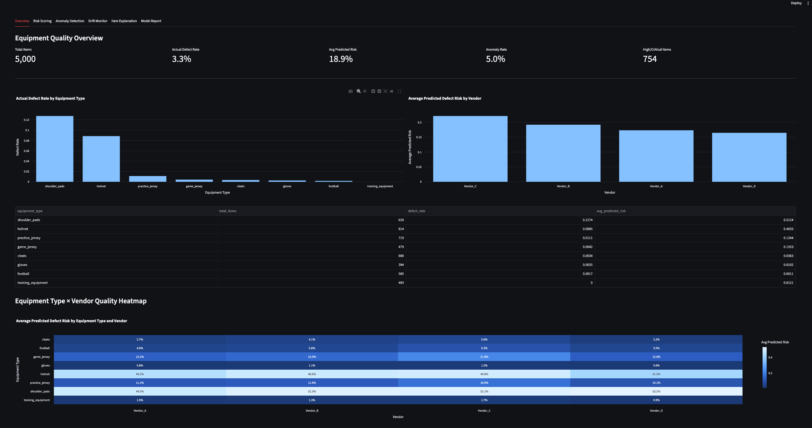
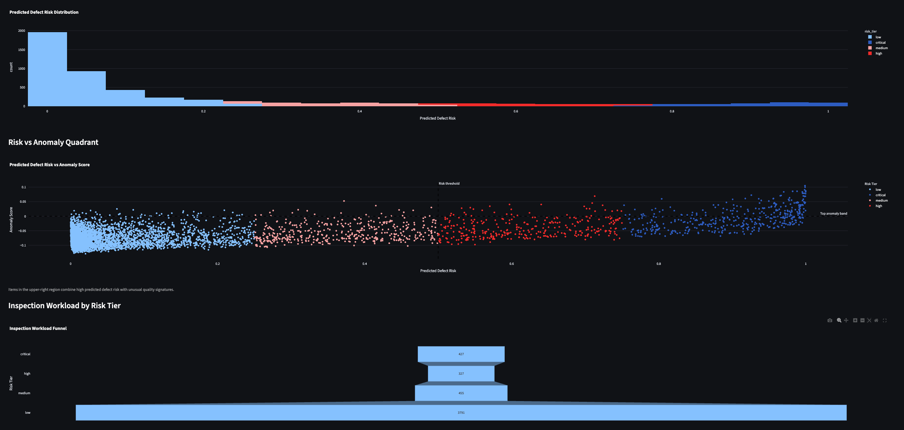
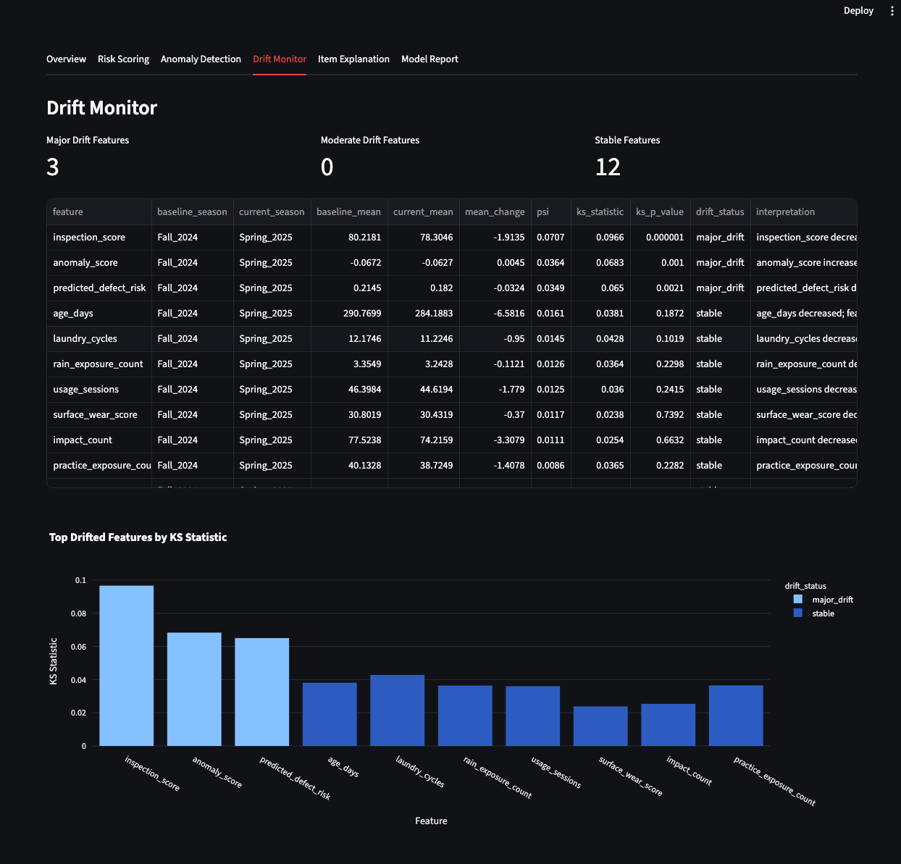
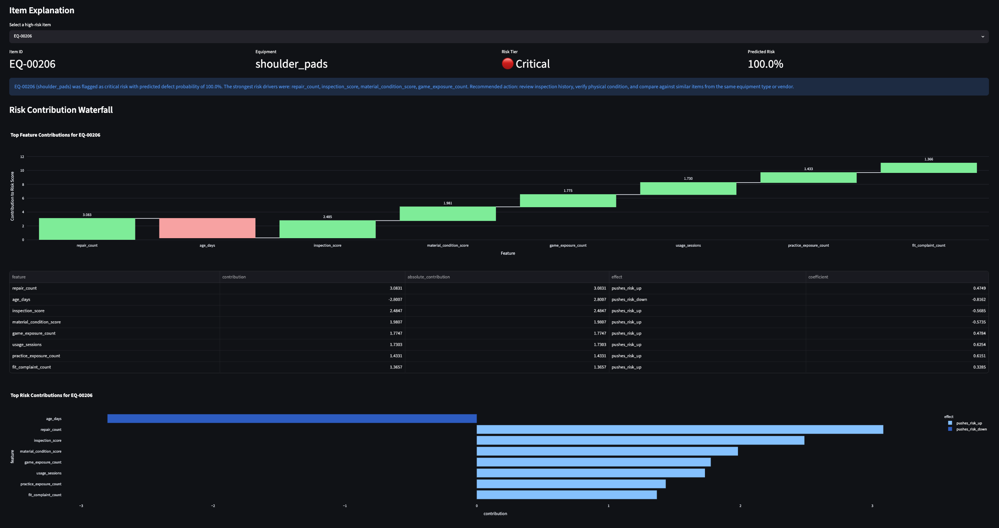
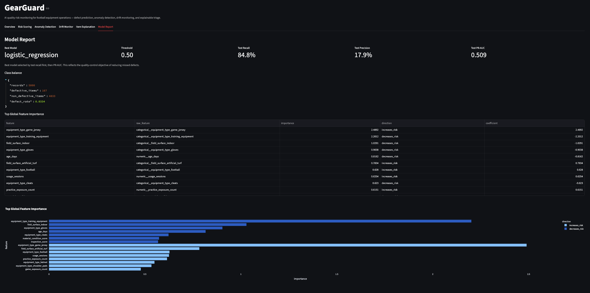

# GearGuard: AI Quality Risk Monitoring for Football Equipment Operations

GearGuard is a manufacturing-style quality analytics project inspired by football equipment operations. It simulates how inspection logs, usage history, repairs, vendor batches, environmental exposure, and equipment condition signals can be used to predict defect risk, detect anomalous quality signatures, monitor drift across seasons, and generate explainable triage insights for faster corrective action.

The project reframes sports equipment operations as a smart manufacturing quality problem: prevent defective or high-risk equipment from reaching active use, reduce operational surprises, and support faster root-cause analysis.

Although the domain is football equipment, the workflow is designed to mirror quality analytics problems in high-volume manufacturing environments: supervised risk prediction, anomaly detection, distribution-shift monitoring, SQL-based data access, model reporting, and lightweight dashboarding.

---

## Project Highlights

- Generated a reproducible synthetic football equipment quality dataset with 5,000 records.
- Built a SQLite data layer with SQL queries for equipment, vendor, and defect summaries.
- Trained imbalanced classification models to predict equipment defect risk.
- Selected a recall-focused Logistic Regression model to reduce missed defects.
- Added Isolation Forest anomaly detection for unusual equipment signatures.
- Built drift monitoring between Fall 2024 and Spring 2025 equipment records.
- Added feature attribution and item-level explanation summaries.
- Built a Streamlit dashboard for risk scoring, anomaly review, drift monitoring, and model reporting.

---

## Results

| Area | Result |
|---|---:|
| Total records | 5,000 |
| Actual defect rate | 3.34% |
| Positive class count | 167 |
| Best model | Logistic Regression |
| Selected threshold | 0.50 |
| Test recall | 84.8% |
| Test precision | 17.9% |
| Test PR-AUC | 0.509 |
| Anomaly rate | 5.00% |
| Major drift features | 3 |
| Top drifted features | `inspection_score`, `anomaly_score`, `predicted_defect_risk` |

The model is intentionally tuned around recall rather than raw accuracy because the operational cost of missing a defective item is higher than the cost of sending extra items for inspection.

---

## Project Motivation

My background includes football equipment operations, competitive rugby leadership, and sports analytics. In equipment operations, quality issues are not just inventory problems. A missed defect can affect player safety, practice efficiency, game readiness, and staff workload.

GearGuard turns that experience into a data science project aligned with manufacturing quality analytics:

- Which equipment items are most likely to fail inspection?
- Which items show unusual usage, repair, or condition patterns?
- Are quality signals drifting across seasons, vendors, or batches?
- What factors are driving a high-risk prediction?
- How can model output be translated into clear operational action?

---

## Problem Statement

Football equipment teams manage large inventories of helmets, shoulder pads, cleats, jerseys, gloves, footballs, and training equipment. Each item accumulates usage, repair history, environmental exposure, inspection scores, and quality outcomes over time.

The objective is to build a quality-risk monitoring system that can:

1. Predict whether an equipment item is likely to fail inspection or require removal from active rotation.
2. Detect anomalous items with unusual usage, repair, or inspection patterns.
3. Monitor drift across seasons and quality signals.
4. Explain the main drivers behind high-risk predictions.
5. Present insights through a lightweight dashboard for operational decision-making.

---

## Business Framing

In quality operations, false negatives are usually more costly than false positives.

For this project:

- A **false positive** means an item may be inspected earlier than necessary.
- A **false negative** means a defective or high-risk item may remain in active use.

Because of this, GearGuard prioritizes recall on defective items while still tracking precision, PR-AUC, and the operational burden of additional inspections.

This mirrors manufacturing quality workflows where reducing escapes is often more important than maximizing raw accuracy.

---

## Dataset

Because public football equipment defect datasets are limited, GearGuard uses a reproducible synthetic dataset designed to simulate realistic equipment-room inspection, usage, repair, vendor, and defect patterns.

The synthetic dataset contains 5,000 equipment-level records with fields including:

- `item_id`
- `equipment_type`
- `vendor`
- `batch_id`
- `season`
- `age_days`
- `usage_sessions`
- `game_exposure_count`
- `practice_exposure_count`
- `rain_exposure_count`
- `laundry_cycles`
- `impact_count`
- `repair_count`
- `fit_complaint_count`
- `surface_wear_score`
- `material_condition_score`
- `inspection_score`
- `storage_humidity`
- `field_surface`
- `storage_location`
- `defect_reported`
- `failure_type`

The target variable is:

- `defect_reported`

This indicates whether an equipment item failed inspection, required removal from rotation, or showed a quality issue requiring corrective action.

The synthetic data generator intentionally makes defects non-random. Defect probability increases based on realistic operational factors such as high usage volume, high impact count, repeated repairs, low inspection scores, poor material condition, rain exposure, storage humidity, and vendor or batch-specific quality differences.

---

## Analytical Workflow

GearGuard follows an end-to-end quality analytics workflow:

1. Generate a synthetic football equipment quality dataset.
2. Load the dataset into SQLite.
3. Query equipment and vendor quality summaries using SQL.
4. Train supervised models for defect-risk prediction.
5. Evaluate the models with imbalance-aware metrics.
6. Score each equipment item with predicted defect risk.
7. Detect anomalous equipment signatures with Isolation Forest.
8. Monitor feature drift between simulated seasons.
9. Explain model predictions through feature attribution.
10. Present outputs in a Streamlit dashboard.

---

## Project Architecture

```text
gear-guard/
│
├── app/
│   └── streamlit_app.py
│
├── data/
│   ├── raw/
│   └── processed/
│       ├── synthetic_equipment_quality.csv
│       ├── equipment_quality_scored.csv
│       └── gear_guard.sqlite
│
├── docs/
│   ├── equipment_inspection_sop.md
│   ├── drift_response_guide.md
│   └── model_card.md
│
├── models/
│   ├── defect_risk_model.joblib
│   └── anomaly_model.joblib
│
├── reports/
│   ├── anomaly_report.json
│   ├── drift_report.csv
│   ├── drift_report.json
│   ├── feature_importance.csv
│   ├── item_explanations.json
│   └── model_report.json
│
├── sql/
│   ├── create_tables.sql
│   ├── high_risk_items.sql
│   ├── quality_summary.sql
│   └── vendor_defect_rates.sql
│
├── src/
│   ├── anomaly.py
│   ├── data_generator.py
│   ├── db.py
│   ├── drift.py
│   ├── evaluate.py
│   ├── explain.py
│   ├── features.py
│   ├── summary.py
│   └── train.py
│
├── requirements.txt
└── README.md
```

---

## Methods

### 1. Synthetic Data Generation

`src/data_generator.py` creates 5,000 equipment records across multiple equipment types, vendors, batches, and seasons.

Equipment types include:

- Helmet
- Shoulder pads
- Cleats
- Practice jersey
- Game jersey
- Football
- Gloves
- Training equipment

The generator produces realistic signal relationships. For example, risk increases with repeated repairs, high impact counts, lower material condition, lower inspection scores, rain exposure, storage humidity, and selected vendor or batch effects.

Output:

```text
data/processed/synthetic_equipment_quality.csv
```

Current generated defect rate:

```text
3.34%
```

---

### 2. SQL Data Layer

`src/db.py` loads the synthetic dataset into a SQLite database.

Output:

```text
data/processed/gear_guard.sqlite
```

The SQL layer supports quality summaries such as:

- Defect rate by equipment type
- Defect rate by vendor
- Highest-risk equipment items
- Average inspection score
- Average wear score
- Repair-count trends

Example SQL files:

- `sql/quality_summary.sql`
- `sql/vendor_defect_rates.sql`
- `sql/high_risk_items.sql`

---

### 3. Defect-Risk Modeling

`src/train.py` trains supervised classification models to predict `defect_reported`.

Models trained:

- Logistic Regression with class weighting
- Random Forest with class weighting

Because defects are rare, the model is evaluated with imbalance-aware metrics instead of accuracy alone.

Primary metric:

- Recall on defective items

Secondary metrics:

- Precision
- F1-score
- PR-AUC
- ROC-AUC
- Confusion matrix

Current best model:

```text
Logistic Regression
```

Current test metrics:

| Metric | Value |
|---|---:|
| Recall | 0.848 |
| Precision | 0.179 |
| PR-AUC | 0.509 |

This means the model catches most defective items while accepting additional false positives for inspection.

Output:

```text
models/defect_risk_model.joblib
reports/model_report.json
```

---

### 4. Anomaly Detection

`src/anomaly.py` applies Isolation Forest to detect unusual equipment quality signatures.

The anomaly model flags approximately 5% of records as anomalous.

Examples of unusual quality signatures may include:

- High impact count combined with repeated repairs
- Low inspection score relative to similar equipment
- Abnormal surface wear patterns
- Unusual vendor or batch-level quality behavior
- High predicted defect risk combined with abnormal usage history

Outputs:

```text
data/processed/equipment_quality_scored.csv
models/anomaly_model.joblib
reports/anomaly_report.json
```

The scored dataset includes:

- `predicted_defect_risk`
- `defect_risk_flag`
- `risk_tier`
- `anomaly_score`
- `anomaly_flag`
- `recommended_action`

---

### 5. Drift Monitoring

`src/drift.py` compares quality signals between:

```text
Baseline season: Fall_2024
Current season: Spring_2025
```

Drift is measured using:

- Population Stability Index
- Two-sample Kolmogorov-Smirnov test

Current drift results:

| Feature | Status | Interpretation |
|---|---|---|
| `inspection_score` | Major drift | Inspection outcomes decreased between seasons. |
| `anomaly_score` | Major drift | Unusual equipment signatures shifted between seasons. |
| `predicted_defect_risk` | Major drift | Overall model-estimated quality risk shifted. |

Outputs:

```text
reports/drift_report.csv
reports/drift_report.json
```

---

### 6. Feature Attribution and Item Explanations

`src/explain.py` generates global feature importance and item-level explanations for high-risk equipment.

For the selected Logistic Regression model, item-level explanations are computed from standardized feature values multiplied by model coefficients. This produces directional feature attribution that shows which variables pushed an item’s risk estimate up or down.

Outputs:

```text
reports/feature_importance.csv
reports/item_explanations.json
```

Example explanation:

```text
EQ-00206 (shoulder_pads) was flagged as critical risk with predicted defect probability of 100.0%. The strongest risk drivers were: repair_count, inspection_score, material_condition_score, game_exposure_count. Recommended action: review inspection history, verify physical condition, and compare against similar items from the same equipment type or vendor.
```

---

## Streamlit Dashboard

The dashboard provides a lightweight interface for reviewing the quality-monitoring workflow.

Run:

```bash
streamlit run app/streamlit_app.py
```

Dashboard tabs:

- **Overview**: overall defect rate, average predicted risk, anomaly rate, defect rate by equipment type, vendor risk comparison
- **Risk Scoring**: high-risk equipment items, predicted defect probability, risk tier, recommended action
- **Anomaly Detection**: anomalous items and anomaly score distribution
- **Drift Monitor**: drifted features and baseline/current season comparison
- **Item Explanation**: item-level drivers behind high-risk predictions
- **Model Report**: selected model, threshold, recall, precision, PR-AUC, and feature importance

## Dashboard Screenshots

### Overview



### Risk Scoring



### Drift Monitor



### Item Explanation



### Model Report



---

## Example Operational Insights

GearGuard surfaces operationally useful insights such as:

- Shoulder pads and helmets show the highest observed defect rates in the generated dataset.
- The selected model reaches 84.8% recall on defective items, supporting a quality workflow focused on reducing missed defects.
- Isolation Forest flags 5% of equipment records as anomalous quality signatures.
- Drift monitoring identifies statistically significant shifts in inspection score, anomaly score, and predicted defect risk between Fall 2024 and Spring 2025.
- Item-level explanations identify operational risk drivers such as repair count, inspection score, material condition, usage sessions, and exposure counts.

---

## Model Card Summary

### Intended Use

GearGuard is intended as a demonstration quality-monitoring system for football equipment operations. It supports inspection prioritization, risk scoring, anomaly detection, drift monitoring, and root-cause-style explanation.

### Not Intended For

The model should not be used as the sole basis for safety-critical decisions. It is a decision-support tool, not a replacement for trained equipment staff or physical inspection.

### Data Limitations

The current dataset is synthetic and designed for workflow demonstration. Real-world deployment would require validated historical inspection logs, repair records, equipment metadata, usage data, and verified defect outcomes.

### Operational Considerations

The model is intentionally recall-oriented. This means it may flag more items for inspection than necessary, but that trade-off is aligned with a quality-control objective where missed defects are more costly than extra inspections.

---

## Tech Stack

- Python
- pandas
- NumPy
- scikit-learn
- SciPy
- SQLite
- Streamlit
- Plotly
- joblib
- pytest
- Git

---

## How to Run

Clone the repository:

```bash
git clone https://github.com/YOUR_USERNAME/gear-guard.git
cd gear-guard
```

Create and activate a virtual environment:

```bash
python3 -m venv venv
source venv/bin/activate
```

Install dependencies:

```bash
pip install -r requirements.txt
```

Generate the synthetic dataset:

```bash
python3 src/data_generator.py
```

Load the dataset into SQLite:

```bash
python3 src/db.py
```

Train the defect-risk model:

```bash
python3 src/train.py
```

Add anomaly scores and risk tiers:

```bash
python3 src/anomaly.py
```

Generate the drift report:

```bash
python3 src/drift.py
```

Generate feature attribution and item explanations:

```bash
python3 src/explain.py
```

Run the dashboard:

```bash
streamlit run app/streamlit_app.py
```

---

## Reproduce the Full Pipeline

Create the virtual environment and install dependencies:

```bash
make setup
make all
make dashboard
make test
```

**OR**

Run the commands in order:

```bash
python3 src/data_generator.py
python3 src/db.py
python3 src/train.py
python3 src/anomaly.py
python3 src/drift.py
python3 src/explain.py
streamlit run app/streamlit_app.py
```

---

## Future Improvements

Potential improvements include:

- Real equipment inspection data integration
- Multi-class failure-type prediction
- Time-series equipment degradation modeling
- Vendor-level quality benchmarking
- More advanced drift monitoring
- RAG-style inspection assistant using local SOPs and model reports
- FastAPI inference endpoint
- Dockerized deployment
- Automated model monitoring
- Integration with inventory management systems

---

## Project Status

V1 Completed.

Current capabilities:

- Synthetic football equipment quality dataset
- SQLite database layer
- SQL quality summary queries
- Defect-risk classification model
- Recall-focused thresholding
- Anomaly detection
- Drift monitoring
- Feature attribution
- Item-level triage summaries
- Streamlit dashboard
